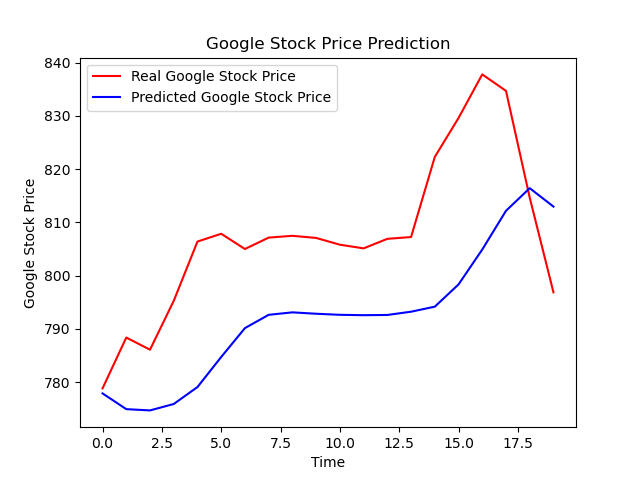

# Google Stock Price Prediction using Recurrent Neural Networks (RNN)


## 📌 Project Overview
This project aims to predict Google stock price trends using **Recurrent Neural Networks (RNNs)**, specifically **Long Short-Term Memory (LSTM)** networks. The model is trained on historical stock price data from **2012 to 2016** and tested on **January 2017** data. The goal is not to predict exact prices but to capture upward and downward trends.

## 📊 Dataset
The dataset consists of Google stock prices:
- **Training Data**: Google stock prices from **2012 to 2016**.
- **Test Data**: Google stock prices for **January 2017**.
- Both datasets contain the **opening price** of each trading day.

## 📈 Model Architecture
The implemented model is a **stacked LSTM** network with multiple layers to capture complex patterns in stock price movements.

### 🔹 Key Features:
- **Data Preprocessing**: Normalization using `MinMaxScaler`.
- **Stacked LSTM**: Four LSTM layers with **50 units each**.
- **Dropout Regularization**: To prevent overfitting.
- **Adam Optimizer**: For efficient training.
- **Loss Function**: Mean Squared Error (MSE).
- **Prediction & Visualization**: Comparison between actual and predicted stock prices.

## 🔧 Installation & Setup
### Dependencies:
Ensure you have the following libraries installed:
```bash
pip install numpy pandas matplotlib keras scikit-learn
```

## 🔧 Running the Project:
1. **Clone the repository:**
   ```bash
   git clone https://github.com/yourusername/google-stock-price-prediction.git
   cd google-stock-price-prediction
   ```
2. **Place the dataset files (`Google_Stock_Price_Train.csv` and `Google_Stock_Price_Test.csv`) in the project directory.**   

3. **Run the repository:**
   ```bash
   python rnn.py
   ```

## 📜 File Structure

```bash
📂 google-stock-price-prediction
 ├── 📄 rnn.py  # Model implementation
 ├── 📊 Google_Stock_Price_Train.csv  # Training dataset
 ├── 📊 Google_Stock_Price_Test.csv  # Test dataset
 ├── 📄 README.md  # Project documentation
```
📉 Results & Visualization




## 🚀 Future Improvements
- Experiment with **different LSTM architectures**.
- Use **GRU (Gated Recurrent Units)** for comparison.
- Incorporate additional **technical indicators** as input features.
- Deploy the model using **Flask or Streamlit**.

## 🤝 Contributing
Feel free to **fork**, **open issues**, and **submit PRs**!

## 📜 License
This project is licensed under the **MIT License**.

